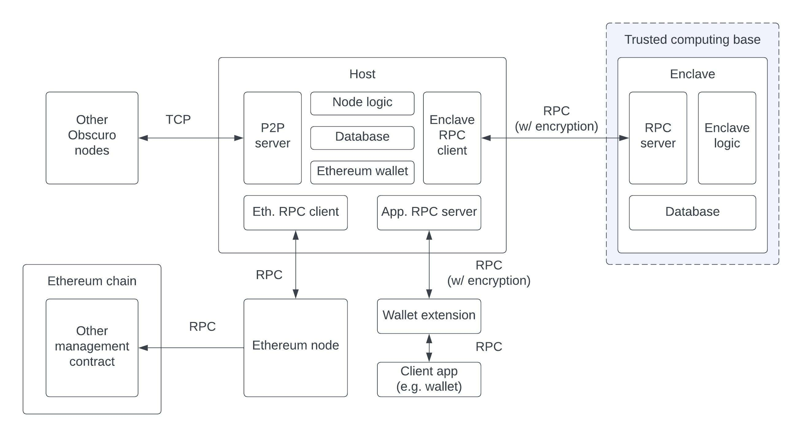

# Obscuro design

## Scope

The purpose of this document is to describe aspects of Obscuro's technical design that are not addressed in the 
[Obscuro whitepaper](https://whitepaper.obscu.ro/).

## Overview

The following diagram shows the key components of an Obscuro deployment:

The Ethereum node and Ethereum chain components shown in this diagram are developed and maintained by third-parties. 
The following additional components must be developed:

* **The enclave:** The trusted part of the Obscuro node that runs inside a trusted execution environment (TEE)
* **The host:** The remainder of the Obscuro node that runs outside the TEE
* **The Obscuro management contract:** The Ethereum mainnet contracts required by the Obscuro protocol, described 
  [here](https://whitepaper.obscu.ro/obscuro-whitepaper/l1-contracts)
* **Client apps:** Applications that interact with the Obscuro node (e.g. Obscuro wallets)

Wherever reasonable, node logic should be part of the host rather than the enclave. This has two benefits:

* It minimises the amount of code in the 
  [trusted computing base (TCB)](https://en.wikipedia.org/wiki/Trusted_computing_base)
* It reduces churn in the TCB, reducing the frequency of re-attestations
